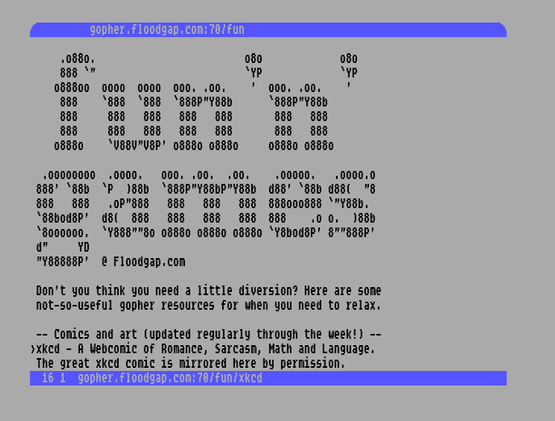

# Gemipher 128
A Gopher client for the Commodore 128. And in the future, possibly also a Gemini client. This is heavily based on the VDC chips hardware capabilities, so a version for the 40 column screen (or the C64) is not something I'm thinking about building.

Currently the program starts at gopher.floodgap.com. From there, you'll find many other Gopher resources to browse (is that term accurate for Gopher?).

Right now, only Gopher directories and Textfiles can be viewed. Downloading files is not implemented yet.

## Keybindings
* H Home - go to startpage
* Cursor left/right - go back and forth in page (hole?) history
* up/down - move the cursor, or scroll the screen
* Return - follow the link behind the currently selected line
* X - Exit the program

## Technical details

### How it works
This is subject to change (of course). I wanted to document the current way of working nonetheless.

Data is downloaded to $0400 in RAM Block 1. Not lower, because that's common RAM for the MMU and it's not wise to try to use that unless there's a reason to.

When parsing the data, the address of each new line is written to the lookup table at $1:f000. Each entry for Gopher directories is 9 bytes long. So we can easily find out where each line starts.

Once data is parsed, we copy the visible part of each line (Gopher lines also contain invisible data, like what type the line is, and where to go, if it's a link) to the buffer area of VRAM (see below's memory map to find out where that is). From there, the visible lines are block-copied from the (invisible) buffer area to the (visible) Screen RAM. This operation is done purely in VRAM.

Copying 25 lines and setting Attribute RAM accordingly (different colors for different line types) is easily done during the vblank period. So, no double buffering is needed.

Speaking of visible text: the character set is aligned so that it fits the ASCII encoding. So, no ASCII-PETSCII conversion is needed. Also, the VDC chip is re-configured to use 9 scanlines per character (instead of the default 8). While the charset itself only utilizes 8 scanlines, the additional empty line improves readability a lot.

When scrolling, the textarea on screen is cleared and all visible lines are again copied. If we reach the end of data in VRAM (either by scrolling up or down), the program copies the required block of data from RAM into VRAM. The interruption for that is noticeable, but still less than a second, I think.

Right now, there is no buffering of any data except the one currently loaded. This goes a bit heavier on the network connection than modern clients would. I'm definitely thinking about solving this.

Of course, memory is a constraint on the Commodore 128. Right now, it should just stop downloading data if RAM is full. Going forward, I want to support GeoRAM and the REU. While this is still no guarantee that all files fit, it makes things easier for sure. That will also allow for a little bit of buffering to take some traffic off of the network.

### Memory map
#### Block 0
* $1c01 the program
* $a800 lookup table for textlines in VRAM (referring to VDC's VRAM, starting at $1000)

#### Block 1
* $0400 the downloaded data (Gopher directory, Textfile)
* $f000 lookup table for textlines in RAM (referring to the data in $0400)

#### VDC VRAM
* $0000 Screen-RAM (2000 bytes)
* $0800 Attribute-RAM (2000 bytes)
* $1000 Buffered lines of text (8000 bytes)
* $3000 Character set. The upper/lower case one only (4000 bytes)

## Still to do
* adding support for memory expansions
* adding support for modems (whatever is most common today, eg on the Ultimate-II or microcontroller based SwiftLink modems)
* 

## More Gopher material

The only other Gopher client for a Commodore 8-bit computer seems to be Hyperlink http://www.armory.com/%7Espectre/cwi/hl/, but I haven't looked into that so far, as it's for the Commodore 64, not the 128.

A great video, explaining Gopher in the year 1995 (in not too great quality, unfortunately) is here: https://www.youtube.com/watch?v=fx7hCQeuEaE
